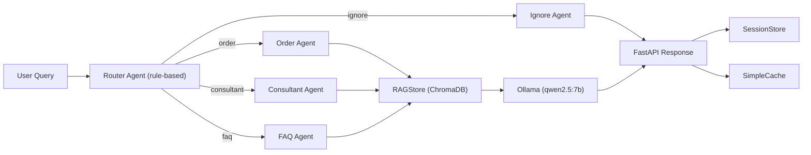

# FI-AI Multi-Agent LLM Test
End-to-end multi-agent LLM system with RAG, local inference, and production-ready design.

## Overview
This repository contains an end-to-end MVP for a multi-agent F&B assistant:

- FastAPI serving layer
- Rule-based Router Agent
- Specialized agents: `order`, `consultant`, `faq`, `ignore`
- RAG pipeline with ChromaDB
- Local LLM inference via Ollama
- Session history + normalized cache
- Lightweight production guardrail for harmful out-of-scope content
- Benchmark script with latency and routing metrics

## Architecture
User Query -> Router -> Specialized Agent -> RAG Retrieval -> LLM Generation -> Response

**Key Insight:** Separating intent routing from generation reduces unnecessary retrieval calls and improves system interpretability.



Core components:

- `app/router_agent.py`: deterministic intent routing
- `app/agents.py`: domain-specific behavior and prompting
- `app/rag.py`: ChromaDB retrieval wrapper
- `app/main.py`: API orchestration, cache, sessions
- `scripts/ingest.py`: menu/faq/docs ingestion
- `scripts/benchmark.py`: evaluation metrics

## Project Structure
```text
app/
data/
scripts/
report/
.github/workflows/
```

## Environment
Benchmark Environment:

- Date: 2026-04-30
- Machine: MacBook Pro M1 Max, 64GB RAM
- Model: `qwen2.5:7b` (Ollama)
- Backend: local inference

## Setup
```bash
python3.11 -m venv venv
source venv/bin/activate
pip install -r requirements.txt
```

Install and start Ollama:
```bash
brew install ollama
brew services start ollama
ollama pull qwen2.5:7b
```

## Data Pipeline
Generate synthetic dataset:
```bash
python scripts/generate_data.py
```

Generated files:

- `data/menu.csv` (~100 rows)
- `data/faq.csv` (~30 rows)
- `data/docs.txt` (~30 chunks)
- `data/synthetic_queries.csv` (~130 rows)

Ingest into ChromaDB:
```bash
python scripts/ingest.py
```

## Run API
```bash
export OLLAMA_MODEL=qwen2.5:7b
uvicorn app.main:app --reload --port 8000
```

Endpoints:

- `GET /health`
- `POST /chat`
- `POST /chat/stream` (SSE)

Quick curl test:
```bash
curl -X POST http://localhost:8000/chat \
  -H "Content-Type: application/json" \
  -d '{"query":"Wifi tên gì vậy?","session_id":"demo"}'
```

## Streaming API
The project includes an SSE streaming endpoint:

```bash
curl -N -X POST http://127.0.0.1:8000/chat/stream \
  -H "Content-Type: application/json" \
  -d '{"query":"Wifi tên gì vậy?","session_id":"stream-demo"}'
```

The endpoint streams tokens from Ollama using `stream=true`.
In production, the same interface can be mapped to vLLM/SGLang streaming APIs.

## LLM Backend Adapter
The system supports a pluggable LLM backend:

- `LLM_BACKEND=ollama` for local Mac development
- `LLM_BACKEND=openai_compat` for vLLM/SGLang/OpenAI-compatible servers

Example production-style configuration:

```bash
export LLM_BACKEND=openai_compat
export OPENAI_COMPAT_BASE_URL=http://<gpu-server>:8001/v1
export OPENAI_COMPAT_MODEL=Qwen/Qwen2.5-7B-Instruct
```

This allows migration to RTX 3060 serving without changing router, agent, RAG, session, cache, or API layers.

## Graph RAG Lite
The system includes a Neo4j-based Graph RAG lite layer.

Graph nodes:
- `MenuItem`
- `FAQ`
- `DocChunk`
- `Category`
- `Sweetness`
- `Caffeine`

Graph retrieval is combined with ChromaDB vector retrieval.
Neo4j is used to demonstrate structured knowledge retrieval and production extensibility.

Run Neo4j:

```bash
docker compose up -d neo4j
python scripts/ingest.py
```

When Neo4j is available, retrieved `sources` may include graph domains such as:
- `graph_menu`
- `graph_faq`
- `graph_doc`

## Benchmark
Run:
```bash
python scripts/benchmark.py
```

Current sample output:

- Router Accuracy: `0.8538`
- Retrieval Coverage: `0.8538`
- Average Latency: `2.8177s`
- P95 Latency: `10.3994s`
- Cache Hit Latency: `0.0029s`

## Guardrails And Streaming Notes
- Guardrail blocks unsafe harmful prompts before routing/retrieval/generation.
- Cache uses normalized query keys to reduce duplicate LLM calls and improve latency.
- Retrieval is filtered by intent to improve relevance and reduce noise.
- The system can be extended to support token streaming via SSE in production.

## Docker
Ollama runs on the host machine. The API can run in Docker:

```bash
docker compose build
docker compose up -d neo4j redis
docker compose run --rm api python scripts/ingest.py
docker compose up
```

Health check:

```bash
curl http://127.0.0.1:8000/health
```

Expected health payload includes:
- `graph_rag_enabled`
- `cache_backend`

## Redis Cache
The cache layer supports Redis with memory fallback.

```bash
docker compose up -d redis
```

If Redis is available, `/health` returns:
- `"cache_backend": "redis"`

If Redis is unavailable, the system automatically falls back to in-memory cache:
- `"cache_backend": "memory"`

## Demo Evidence
Real API responses for order, consultant, FAQ, ignore, and repeated FAQ cache-hit are saved in:

- `report/demo_chat_examples.md`
- `report/demo_chat_examples_2026-04-30.json`

## Metric Notes
Retrieval Coverage is used as a proxy metric for retrieval quality in this prototype.
Production evaluation should use labeled relevance data with `precision@k` / `recall@k`.

## Deployment Note
This prototype runs locally on MacBook M1 Max using Ollama.
GPU-based benchmarking on RTX 3060 was not performed due to hardware constraints.

The architecture is deployment-ready for GPU serving by replacing only the LLM backend with vLLM/SGLang, while keeping router, agents, RAG, session, cache, and API layers unchanged.

## CI
GitHub Actions workflow (`.github/workflows/ci.yml`) validates:

- dependency install
- syntax compile check
- data generation pipeline

## Demo Checklist
Recommended demo flow:

1. `/health`
2. order query
3. consultant query
4. FAQ query
5. ignore query
6. repeat FAQ query (cache hit)
