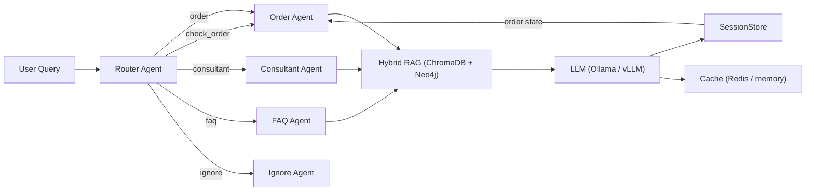

# FI-AI Multi-Agent F&B Assistant

End-to-end multi-agent LLM system with hybrid RAG, local inference, and production-ready design.

## Overview

A Vietnamese F&B assistant that routes customer queries to specialized agents:

| Intent | Agent | Behavior |
|--------|-------|----------|
| `order` | OrderAgent | Menu ordering, cart accumulation, order summaries |
| `check_order` | OrderAgent | Structured order state lookup (no hallucination) |
| `consultant` | ConsultantAgent | Taste-based recommendations |
| `faq` | FAQAgent | WiFi, hours, payment, policy |
| `ignore` | IgnoreAgent | Greetings, noise, out-of-scope |

## Architecture

```
User Query
  └─> Router Agent (LoRA SFT > Ollama SLM > TF-IDF > rule-based)
       ├─> OrderAgent ──> Hybrid RAG (ChromaDB + Neo4j) ──> LLM
       ├─> ConsultantAgent ──> Hybrid RAG ──> LLM
       ├─> FAQAgent ──> Hybrid RAG ──> LLM
       └─> IgnoreAgent ──> Static response

Response
  └─> SessionStore (structured order state + history)
  └─> Cache (paraphrase-lite Redis / in-memory)
```



## Key Features

- **Hybrid Router** — 4-layer cascade: LoRA SFT > Ollama SLM > TF-IDF LogReg > rule-based
- **Structured Order State** — Cart persists across turns without LLM hallucination. Order state is parsed from LLM responses and stored in `SessionStore`, then injected into prompts for consistent cart management
- **Keyword Boost RAG** — Substring matching + reranker blending ensures menu items like "trà đào" correctly match "Trà Đào Cam Sả"
- **BGE Reranker v2** — Cross-encoder reranking on retrieved candidates before generation
- **Concurrent LLM Queue** — Semaphore-based concurrency control prevents GPU overload
- **Paraphrase-lite Cache** — Normalizes common Vietnamese paraphrases into shared keys (Redis-backed with in-memory fallback)
- **Streaming SSE** — Token-by-token streaming via `/chat/stream`
- **Guardrails** — Blocks unsafe prompts before routing

## Quick Start

```bash
# 1. Setup
python3.11 -m venv .venv3
source .venv3/bin/activate
pip install -r requirements.txt

# 2. Install Ollama
brew install ollama && brew services start ollama
ollama pull qwen2.5:7b

# 3. Ingest data
python scripts/ingest.py

# 4. Run
export OLLAMA_MODEL=qwen2.5:7b
uvicorn app.main:app --reload --port 8000
```

## Endpoints

| Method | Path | Description |
|--------|------|-------------|
| `GET` | `/health` | System health + RAG doc count + cache backend |
| `POST` | `/chat` | Synchronous chat with full metadata |
| `POST` | `/chat/stream` | SSE streaming chat |
| `POST` | `/cache/invalidate` | Clear all cache entries |
| `GET` | `/cache/stats` | Cache hit/miss statistics |
| `GET` | `/session/{id}` | Session history + order state |

### Chat Request

```bash
curl -X POST http://localhost:8000/chat \
  -H "Content-Type: application/json" \
  -d '{
    "query": "Cho anh 1 ly cà phê sữa đá size M, thêm 1 bánh croissants",
    "session_id": "demo-001"
  }'
```

### Streaming

```bash
curl -N -X POST http://127.0.0.1:8000/chat/stream \
  -H "Content-Type: application/json" \
  -d '{"query":"Wifi tên gì?","session_id":"stream-demo"}'
```

### Cache Management

```bash
# Clear cache before demo runs
curl -X POST http://localhost:8000/cache/invalidate

# Check cache stats
curl http://localhost:8000/cache/stats
```

## Data Pipeline

```bash
# Generate synthetic data
python scripts/generate_data.py

# Ingest into ChromaDB + Neo4j
python scripts/ingest.py
```

Generates and loads:

- `data/menu.csv` — 105 items (Coffee, Tea, Food)
- `data/faq.csv` — 30 FAQ entries
- `data/docs.txt` — 30 document chunks
- `data/synthetic_queries.csv` — 130 labeled queries

## Router Layers

### Layer 1 — LoRA SFT (Qwen2.5-0.5B fine-tuned)

```bash
python scripts/train_router.py
# Output: models/router_model.joblib + models/router_sft/
```

### Layer 2 — Ollama SLM (optional)

```bash
ollama pull qwen2.5:1.5b
export SLM_ROUTER_ENABLED=true
export SLM_ROUTER_MODEL=qwen2.5:1.5b
```

### Layer 3 — TF-IDF + Logistic Regression

```bash
python scripts/train_router.py  # also trains this
```

### Layer 4 — Rule-based fallback

Keyword matching across `ORDER_KEYWORDS`, `CONSULTANT_KEYWORDS`, `FAQ_KEYWORDS`, `IGNORE_KEYWORDS`, and `CHECK_ORDER_KEYWORDS`.

**Intents:** `order`, `check_order`, `consultant`, `faq`, `ignore`

## RAG Pipeline

### Vector Store (ChromaDB)

- Embedding: `sentence-transformers/paraphrase-multilingual-MiniLM-L12-v2`
- Collection: `fnb_knowledge` (menu, faq, doc)
- Filtered by intent domain at query time

### Reranker (BGE Reranker v2)

- Fetches 15 candidates from ChromaDB
- Reranks with cross-encoder scores
- Keyword boost applied before reranking to surface exact menu name matches

### Keyword Boost

When a query contains tokens that appear in a menu item name (e.g., "trà đào" in "Trà Đào Cam Sả"), the matching document is boosted significantly before reranking. This prevents embedding quality issues from hiding relevant items.

### Graph Store (Neo4j, optional)

```bash
docker compose up -d neo4j
python scripts/ingest.py  # re-ingests into Neo4j
```

Nodes: `MenuItem`, `FAQ`, `DocChunk`, `Category`, `Sweetness`, `Caffeine`

## LLM Backend

Switch between Ollama (local Mac) and vLLM/SGLang (GPU server) without changing any other layer:

```bash
# Local Mac
export LLM_BACKEND=ollama
export OLLAMA_MODEL=qwen2.5:7b

# GPU server
export LLM_BACKEND=openai_compat
export OPENAI_COMPAT_BASE_URL=http://<gpu>:8001/v1
export OPENAI_COMPAT_MODEL=Qwen/Qwen2.5-7B-Instruct
```

## Order State Management

The system maintains a structured order cart per session in `SessionStore`:

1. LLM generates an order response
2. `_update_order_state()` parses items from the response text using regex
3. Parsed items `{name, size, quantity, price}` are stored in `SessionStore`
4. On subsequent turns, `build_agent_prompt()` injects `format_order_summary()` into the prompt
5. `answer_check_order()` reads directly from structured state (no LLM hallucination)

**Structured order state prevents:**
- Double-counting items across turns
- LLM hallucinating wrong cart contents
- Miscalculated totals

## Guardrails

The `guardrails.py` module blocks harmful, illegal, and out-of-scope queries before routing:

```python
is_guardrail_blocked("how to make a bomb")  # True -> returns safe error
```

## Cache

The `SimpleCache` (Redis with in-memory fallback) stores responses keyed by normalized query hash:

- Paraphrase normalization: "Wifi tên gì?" and "Cho em xin wifi" share the same cache key
- Semantic similarity: uses paraphrase-lite string normalization (punctuation, spacing, case)

```python
cache.get(query)     # returns cached response or None
cache.set(query, response)
cache.invalidate()    # clear all
```

## Benchmark

```bash
python scripts/benchmark.py
```

Sample metrics:

- Router Accuracy: ~0.95
- Retrieval Coverage: ~0.95
- Average Latency: ~2.5s (local Ollama)
- Cache Hit Latency: ~3ms

## Docker

```bash
docker compose build
docker compose up -d neo4j redis
docker compose run --rm api python scripts/ingest.py
docker compose up
```

## Project Structure

```text
app/
  main.py          # FastAPI app, endpoints, order state parser
  router_agent.py  # 4-layer intent router
  agents.py        # OrderAgent, ConsultantAgent, FAQAgent, IgnoreAgent
  rag.py           # ChromaDB + BGE Reranker + keyword boost
  graph_rag.py     # Neo4j Graph RAG
  session_store.py # In-memory sessions + structured order state
  cache.py         # Redis / in-memory cache
  guardrails.py    # Safety filter
  config.py        # Environment variables
data/
  menu.csv         # 105 items (Coffee, Tea, Food)
  faq.csv          # 30 FAQ entries
  docs.txt         # 30 document chunks
scripts/
  ingest.py        # Load data into ChromaDB + Neo4j
  generate_data.py # Synthesize dataset
  train_router.py  # Train TF-IDF + LogReg + LoRA SFT
  benchmark.py     # Latency + accuracy evaluation
models/
  router_model.joblib  # TF-IDF + LogReg
  router_sft/          # LoRA fine-tuned weights
report/
  technical_report.html
  VIDEO_DEMO_SCRIPT.md
  benchmark_final.txt
```

## Demo Checklist

Recommended 5-turn flow for presentation:

1. Order coffee + food → `POST /chat`
2. Ask WiFi (different intent) → `POST /chat`
3. Add a drink (cart accumulates) → `POST /chat`
4. Check order (structured state) → `POST /chat`
5. Add another drink → `POST /chat`

Before each demo run:

```bash
curl -X POST http://localhost:8000/cache/invalidate
```
